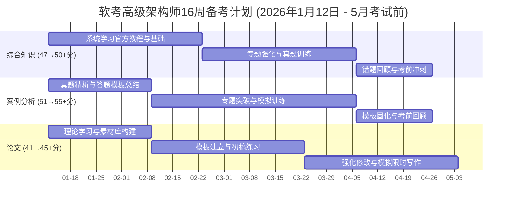

# 软考高级架构师备考策略与计划

结合去年**综合知识47分、案例分析51分、论文41分**的成绩，可以看出**技术理解（案例分析）** 已经达到及格要求，**知识广度（综合知识）** 也已接近，**系统化写作能力（论文）** 是当前的明显短板，需要重点突破。

## 成绩分析与备考现状

| 科目 | 成绩 | 及格线 | 优势/短板分析 | 备考核心 |
| :--- | :--- | :--- | :--- | :--- |
| **综合知识** | 47分 | 45分 | **知识广度尚可，但不稳固**：离及格线很近，但需要系统化梳理，重点提升非技术知识领域（如项目管理、法律法规）的得分。 | 查漏补缺，固化优势，确保稳定及格。 |
| **案例分析** | 51分 | 45分 | **核心优势科目**：已掌握分析思路和技术场景应用，是提分和保底的关键。 | 巩固优势，总结模板，保持手感。 |
| **论文** | 41分 | 45分 | **主要短板**：分数差距最大，是备考的重中之重。可能存在的问题包括**结构不清晰、内容空泛、或技术与项目结合不紧密**。 | 强化模板练习，积累真实素材，针对性训练。 |

2026年1月12日至5月考试，还有约4个月的复习时间，这完全符合高级架构师通常需要**4-6个月**的备考周期建议，时间规划得当是足够的。

## 各科目针对性提分策略

### 备考路线图

### 综合知识：系统梳理，查漏补缺

目标是稳定在50分以上。

- **前期 (第1-6周)**：以官方教程为核心，梳理知识体系，尤其重视**软件工程、软件架构设计、项目管理**等占分高的章节。可配合一些高质量的培训视频或线上课程加深理解。
- **中期 (第7-12周)**：进入**真题训练**阶段。坚持每天或每两天完成一套历年选择题，并建立**错题本**。错题本不仅要记录正确答案，更要分析错误原因，回归知识点本身。
- **后期 (第13-16周)**：反复复习错题本，巩固记忆模糊点。可以快速翻阅"考前几页纸"或知识点集锦，强化整体印象。

### 案例分析：固化优势，提炼模板

目标是冲刺55分以上。

- **核心策略**：案例分析的核心是掌握**解题思路和答题规范**。需要通过大量练习，总结出常见题型（如架构设计、性能优化、可靠性分析）的**标准化答题模板**。
- **真题练习**：研究历年真题的参考答案（如2025年的真题详解），学习其分析问题的逻辑和表述方式。练习时，先读问题再看题干。
- **临场技巧**：考试时，**选择最有把握的题目作答**。如果遇到陌生题型，优先选择包含选择题或填空题的小问，更容易得分。

### 论文：重点突破，勤写多改

这是成败的关键。目标是从41分提升至至少45分，需付出最大努力。

**前期 (第1-4周)：积累素材**

1. **确定项目背景**：准备1-2个亲身参与过的、规模适中的软件项目。整理项目的**背景、目标、角色、主要挑战、采用的技术和最终效果**。数据要真实或合理。
2. **关注技术热点**：根据最新真题趋势，提前了解如**无服务器架构(Serverless)、云原生数据库、微服务、知识图谱**等技术。

**中期 (第5-10周)：建立模板并练习**

1. **形成个人模板**：总结一个**属于自己的万能论文框架**：
   - **摘要**：300字内，精炼项目背景、职责、采用的核心技术和最终效果。
   - **项目概述**：500-600字，详细介绍项目背景、规模、角色、主要挑战和整体方案。
   - **正文（核心）**：根据题目要求，分2-3个论点展开。每个论点采用"**问题/需求 → 技术选型/解决方案 → 具体实施与效果**"的结构。
   - **总结**：200-300字，回顾项目成果，反思不足，展望未来。
2. **动笔练习**：至少**用这个模板练习撰写3-5篇不同主题的完整论文**。严格控制时间，练习时先**不要查阅资料**。

**后期 (第11-16周)：精修与模拟**

1. **找人批改或自我审查**：检查逻辑是否通顺，技术描述是否准确，项目细节是否前后一致。
2. **模拟考试**：考前进行1-2次全真模拟，在120分钟内完成从选题到成文的全部过程。
3. **打字速度**：确保打字熟练，考试键盘可能不顺手，需提前适应。

## 整体备考心态与建议

1. **时间管理**：作为在职考生，需要保证平均每天**2-3小时**的有效学习时间，周末适当增加。坚持比突击更重要。
2. **真题为王**：无论哪一科，**近5-8年的真题**都是最好的复习资料。建议至少做3遍以上。
3. **资源利用**：官方教材是基础。可以合理利用一些高质量的备考公众号、论坛或线上课程，获取资料和经验。
4. **保持信心**：软考高级通过率虽低（普遍在5%-15%左右），但这是包含大量弃考和试水考生的数据。已有去年的实战经验和及格的分析能力，只要针对论文短板系统准备，完全有把握在今年通过。

总的来说，离成功已经很近。**核心战略就是"保住案例分析优势，确保综合知识稳定过线，集中所有火力攻克论文"**。

如果能分享更多关于专业背景和日常时间安排的信息，可以提供更具个性化的周计划时间表示例。